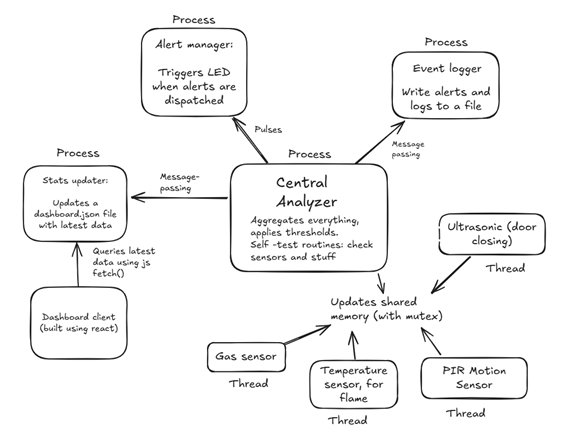

# Home Safety System

A real-time home safety monitoring and alerting system for QNX. This is a 3-person mini-project for an RTOS course, demonstrating multi-process architecture, inter-process communication, and real-time sensor integration.

## Overview

This project implements a multi-process architecture that reads from multiple environmental sensors (temperature, humidity, gas, motion, and ultrasonic distance), aggregates the data, logs events, and triggers alerts when threshold conditions are met. It includes a web-based dashboard for real-time visualization.

## System Architecture



## Sensors

- **DHT11** (GPIO4): Temperature and humidity monitoring
- **MQ135** (GPIO27): Gas detection (CO2, smoke, etc.)
- **PIR** (GPIO21): Motion detection
- **HC-SR04** (GPIO13/25): Ultrasonic distance sensor for door state detection

## Building

Make sure you have the QNX toolchain installed and configured:

```bash
make clean
make
```

Binaries will be compiled into the `bins/` directory. Alternatively, the project can be built using the QNX Momentics IDE.

## Deployment

Upload and run on the Raspberry Pi running QNX:

```bash
bash scripts/upload_to_pi.sh
```

This script will:
1. Copy all binaries to the target device
2. Set executable permissions

## Configuration

Threshold values can be adjusted in `central_analyzer.c`:

- Temperature thresholds (high/low)
- Humidity thresholds (high/low)
- Door closed distance threshold

## Frontend Dashboard

The web dashboard provides real-time visualization of sensor data. See `frontend/README.md` for setup instructions.

## Acknowledgments

This project references code and examples from:
- [QNX RPI GPIO](https://gitlab.com/qnx/projects/rpi-gpio)
- [QNX Hardware Component Samples](https://gitlab.com/qnx/projects/hardware-component-samples)

## License

MIT